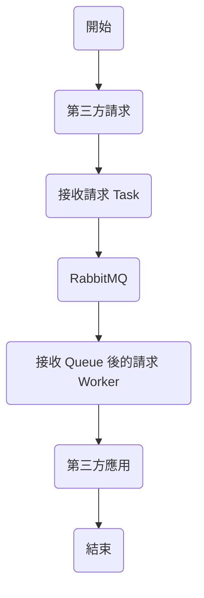
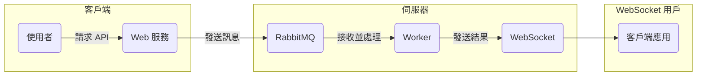
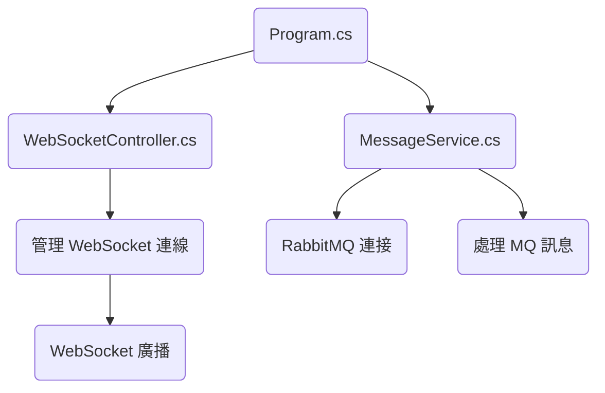
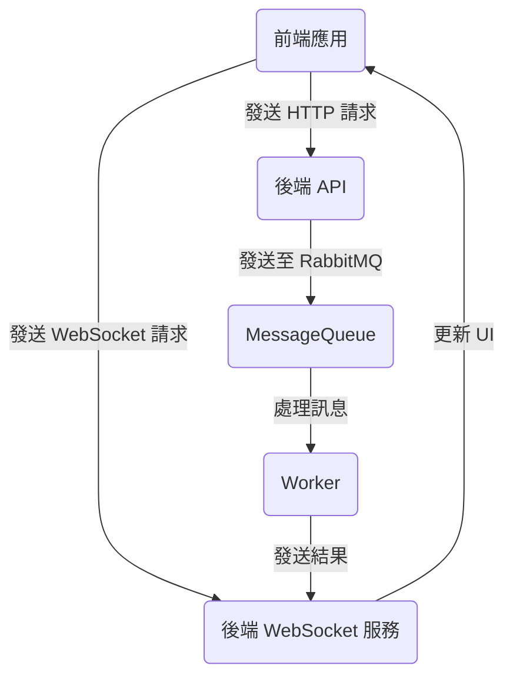

# RabbitMQ 功能演示

除了官方基礎的 RabbitMQ 教學，實作了 Worker 模式使用 WebSocket 監看 Worker 接收的消息。

## 流程圖

### 圖 1：請求流程



### 圖 2：系統架構



### 圖 3：程式架構



### 圖 4：應用程式架構



## 開始使用(Getting Started)

執行 Worker docker-compose 包含 RabbitMQ

```bash
docker-compose up -d --scale worker=1
```

執行完後先關掉 Worker container


網址輸入 http://localhost:15672 登入RabbitMQ


再執行 Task 網址輸入 http://localhost:5000 可以先發送10個請求


RabbitMQ 的 Messages 10 就有10筆正在 Ready


可以再啟動 Worker container 就會把10筆消化了


試試多一點 worker 可以下
```bash
docker-compose up -d --scale worker=5
```


讓 Task 次數多一些，如：10000次


可以看到 worker 平均分散掉了請求


### 環境需求(Prerequisites)
- Visual Studio 2022 or later
- Basic knowledge of C#
- .NET 8
- Docker

## 貢獻(Contributing)

Contributions are welcome! Please fork the repository and create a pull request with your changes.

歡迎貢獻！請 fork 這個倉庫並創建 pull request 提交你的更改。
